# coordinationmethod

## Class Diagram

*Click on class names to navigate to their documentation.*

```mermaid
%%{init: {'theme': 'base', 'themeVariables': { 'primaryColor': '#e6f4f7', 'primaryBorderColor': '#035970', 'primaryTextColor': '#000000', 'lineColor': '#035970', 'secondaryColor': '#cce9ef', 'tertiaryColor': '#f5fafb', 'noteBkgColor': '#e6f4f7', 'noteBorderColor': '#035970', 'fontFamily': 'Arial, sans-serif'}}}%%
classDiagram
    direction TB

    class ALADIN:::localStyle {
        -_allowediterationschemes
        -_unrecommendediterationschemes
        -_recommendediterationschemes
        -_convergence_indicator_innerloop
        -_convergence_indicator_outerloop
        -_updatecouplingparametermethod_outerloop
        -_iterationscheme
        +__init__(convergence_indicator_innerloop, convergence_indicator_outerloop, ...)
        +validate_inputs()
        +createSubSystems(id_list, level_list, ...)
        +createControllerSubSystem(subsystemsIn)
        +createMiddleLevel(idparent, idchild, ...)
        ...
    }

    class ALC:::localStyle {
        -_allowediterationschemes
        -_unrecommendediterationschemes
        -_recommendediterationschemes
        -_convergence_indicator_innerloop
        -_convergence_indicator_outerloop
        -_updatecouplingparametermethod_outerloop
        -_iterationscheme
        +__init__(convergence_indicator_innerloop, convergence_indicator_outerloop, ...)
        +validate_inputs()
        +createSubSystems(id_list, level_list, ...)
        +createControllerSubSystem(subsystemsIn)
        +createMiddleLevel(idparent, idchild, ...)
        ...
    }

    class Consensus_ALC:::localStyle {
        -_allowediterationschemes
        -_unrecommendediterationschemes
        -_recommendediterationschemes
        -_convergence_indicator_innerloop
        -_convergence_indicator_outerloop
        -_updatecouplingparametermethod_outerloop
        -_iterationscheme
        +__init__(convergence_indicator_innerloop, convergence_indicator_outerloop, ...)
        +validate_inputs()
        +createSubSystems(id_list, level_list, ...)
        +createControllerSubSystem(subsystemsIn)
        +createMiddleLevel(idparent, idchild, ...)
        ...
    }

    class CoordinationMethodBasis:::localStyle {
        -_iterationscheme
        -_allowediterationschemes
        -_unrecommendediterationschemes
        -_recommendediterationschemes
        -_convergence_indicator_innerloop
        -_convergence_indicator_outerloop
        -_updatecouplingparametermethod_outerloop
        +__init__()
        +get_IterationScheme()
        +get_AllowedIterationSchemes()
        +get_UnrecommendedIterationSchemes()
        +get_RecommendedIterationSchemes()
        ...
    }

    class CoordinationMethodInterface:::abstractStyle {
        <<abstract>>
        +validate_inputs()
        +get_Convergence_Indicator_Innerloop()
        +get_Convergence_Indicator_Outerloop()
        +createSubSystems(id_list, level_list, ...)
        +createControllerSubSystem(subsystemsIn)
        ...
    }

    class LC:::localStyle {
        -_allowediterationschemes
        -_unrecommendediterationschemes
        -_recommendediterationschemes
        -_convergence_indicator_innerloop
        -_convergence_indicator_outerloop
        -_updatecouplingparametermethod_outerloop
        -_iterationscheme
        +__init__(convergence_indicator_innerloop, convergence_indicator_outerloop, ...)
        +validate_inputs()
        +createSubSystems(id_list, level_list, ...)
        +createControllerSubSystem(subsystemsIn)
        +createMiddleLevel(idparent, idchild, ...)
        ...
    }

    class PC:::localStyle {
        -_allowediterationschemes
        -_unrecommendediterationschemes
        -_recommendediterationschemes
        -_convergence_indicator_innerloop
        -_convergence_indicator_outerloop
        -_updatecouplingparametermethod_outerloop
        -_iterationscheme
        +__init__(convergence_indicator_innerloop, convergence_indicator_outerloop, ...)
        +validate_inputs()
        +createSubSystems(id_list, level_list, ...)
        +createControllerSubSystem(subsystemsIn)
        +createMiddleLevel(idparent, idchild, ...)
        ...
    }

    class SBDP:::localStyle {
        -_allowediterationschemes
        -_unrecommendediterationschemes
        -_recommendediterationschemes
        -_convergence_indicator_innerloop
        -_convergence_indicator_outerloop
        -_updatecouplingparametermethod_outerloop
        -_iterationscheme
        +__init__(convergence_indicator_innerloop, convergence_indicator_outerloop, ...)
        +validate_inputs()
        +createSubSystems(id_list, level_list, ...)
        +createControllerSubSystem(subsystemsIn)
        +createMiddleLevel(idparent, idchild, ...)
        ...
    }

    CoordinationMethodBasis <|-- ALADIN
    CoordinationMethodBasis <|-- ALC
    CoordinationMethodBasis <|-- Consensus_ALC
    CoordinationMethodInterface <|-- CoordinationMethodBasis
    CoordinationMethodBasis <|-- LC
    CoordinationMethodBasis <|-- PC
    CoordinationMethodBasis <|-- SBDP

    %% Click handlers for navigation to documentation
    click ALADIN href "ALADIN/" "View ALADIN documentation"
    click ALC href "ALC/" "View ALC documentation"
    click Consensus_ALC href "Consensus_ALC/" "View Consensus_ALC documentation"
    click CoordinationMethodBasis href "CoordinationMethodBasis/" "View CoordinationMethodBasis documentation"
    click CoordinationMethodInterface href "CoordinationMethodInterface/" "View CoordinationMethodInterface documentation"
    click LC href "LC/" "View LC documentation"
    click PC href "PC/" "View PC documentation"
    click SBDP href "SBDP/" "View SBDP documentation"

    %% Style definitions
    classDef packageStyle fill:#e8e8e8,stroke:#999999,stroke-width:2px
    classDef externalStyle fill:#fff8e6,stroke:#FFCC80,stroke-width:2px
    classDef projectStyle fill:#e6f4f7,stroke:#035970,stroke-width:2px
    classDef projectAbstractStyle fill:#e6f4f7,stroke:#035970,stroke-width:2px,stroke-dasharray:5 5
    classDef localStyle fill:#e6f4f7,stroke:#035970,stroke-width:2px
    classDef abstractStyle fill:#e6f4f7,stroke:#035970,stroke-width:2px,stroke-dasharray:5 5
```

## Modules

- [ALADIN](ALADIN.md)
- [ALC](ALC.md)
- [Consensus_ALC](Consensus_ALC.md)
- [CoordinationMethodBasis](CoordinationMethodBasis.md)
- [CoordinationMethodInterface](CoordinationMethodInterface.md)
- [LC](LC.md)
- [PC](PC.md)
- [SBDP](SBDP.md)

