# coordination

## Class Diagram

*Click on class names to navigate to their documentation.*

```mermaid
%%{init: {'theme': 'base', 'themeVariables': { 'primaryColor': '#e6f4f7', 'primaryBorderColor': '#035970', 'primaryTextColor': '#000000', 'lineColor': '#035970', 'secondaryColor': '#cce9ef', 'tertiaryColor': '#f5fafb', 'noteBkgColor': '#e6f4f7', 'noteBorderColor': '#035970', 'fontFamily': 'Arial, sans-serif'}}}%%
classDiagram
    direction TB

    %% Sub-packages (click to navigate)
    class convergence["convergence/"]:::packageStyle
    class coordinationmethod["coordinationmethod/"]:::packageStyle
    class innerloop_iterationscheme["innerloop_iterationscheme/"]:::packageStyle
    class updatecouplingparametermethod["updatecouplingparametermethod/"]:::packageStyle

    %% External classes (not in this project)
    class BaseManager:::externalStyle {
        <<external>>
    }

    %% Classes from other packages (clickable)
    class HistoryEntry:::projectStyle {
        <<project>>
    }

    class Coordinator:::localStyle {
        -_subsystems
        -_inputfile
        -_outerloop_itr
        -_innerloop_itr
        -_innerloop_itr_runtime
        -_innerloop_itr_numberofdesignvariableevaluations
        -_manager
        ...
        +__init__(subsystemsIn, inputfile)
        +run()
        +initialize()
        +outerloop_iteration()
        +innerloop_iteration()
        ...
    }

    class CoordinatorHistoryEntry:::localStyle {
        -_maxinconsistencyvalue
        -_maxinconsistencyID
        -_maxratioofactiveconstraints
        -_maxratioofactiveconstraintsID
        -_performancemetrics
        -_centralitymeasures
        -_compromisemeasures
        ...
        +__init__(outerloop_itr, innerloop_itr, ...)
        +get_MaxInconsistencyValue()
        +get_MaxInconsistencyValueSubsystemID()
        +get_MaxRatioOfActiveConstraints()
        +get_MaxRatioOfActiveConstraintsSubsystemID()
        ...
    }

    class CustomManager:::localStyle {
        +register_all_data_storages(cls)
    }

    class InputFileBasis:::localStyle {
        -_subsystems
        -_coordinationmethod
        -_iterationscheme
        -_name
        +__init__()
        +get_Subsystems()
        +get_CoordinationMethod()
        +get_IterationScheme()
        +get_Name()
        ...
    }

    class InputFileInterface:::abstractStyle {
        <<abstract>>
        +get_Subsystems()
        +get_CoordinationMethod()
        +get_IterationScheme()
        +get_Name()
        +get_HistoryFolderPath()
        +print_startup_summary()
    }

    HistoryEntry <|-- CoordinatorHistoryEntry
    BaseManager <|-- CustomManager
    InputFileInterface <|-- InputFileBasis

    %% Click handlers for navigation to documentation
    click convergence href "convergence/" "Browse convergence package"
    click coordinationmethod href "coordinationmethod/" "Browse coordinationmethod package"
    click innerloop_iterationscheme href "innerloop_iterationscheme/" "Browse innerloop_iterationscheme package"
    click updatecouplingparametermethod href "updatecouplingparametermethod/" "Browse updatecouplingparametermethod package"
    click HistoryEntry href "../subsystem/historyentry/HistoryEntry/" "View HistoryEntry documentation"
    click Coordinator href "Coordinator/" "View Coordinator documentation"
    click CoordinatorHistoryEntry href "CoordinatorHistoryEntry/" "View CoordinatorHistoryEntry documentation"
    click CustomManager href "CustomManager/" "View CustomManager documentation"
    click InputFileBasis href "InputFileBasis/" "View InputFileBasis documentation"
    click InputFileInterface href "InputFileInterface/" "View InputFileInterface documentation"

    %% Style definitions
    classDef packageStyle fill:#e8e8e8,stroke:#999999,stroke-width:2px
    classDef externalStyle fill:#fff8e6,stroke:#FFCC80,stroke-width:2px
    classDef projectStyle fill:#e6f4f7,stroke:#035970,stroke-width:2px
    classDef projectAbstractStyle fill:#e6f4f7,stroke:#035970,stroke-width:2px,stroke-dasharray:5 5
    classDef localStyle fill:#e6f4f7,stroke:#035970,stroke-width:2px
    classDef abstractStyle fill:#e6f4f7,stroke:#035970,stroke-width:2px,stroke-dasharray:5 5
```

## Subpackages

- [convergence](convergence/index.md)
- [coordinationmethod](coordinationmethod/index.md)
- [innerloop_iterationscheme](innerloop_iterationscheme/index.md)
- [updatecouplingparametermethod](updatecouplingparametermethod/index.md)

## Modules

- [Coordinator](Coordinator.md)
- [CoordinatorHistoryEntry](CoordinatorHistoryEntry.md)
- [CustomManager](CustomManager.md)
- [InputFileBasis](InputFileBasis.md)
- [InputFileInterface](InputFileInterface.md)

