# updatecouplingparametermethod

## Class Diagram

*Click on class names to navigate to their documentation.*

```mermaid
%%{init: {'theme': 'base', 'themeVariables': { 'primaryColor': '#e6f4f7', 'primaryBorderColor': '#035970', 'primaryTextColor': '#000000', 'lineColor': '#035970', 'secondaryColor': '#cce9ef', 'tertiaryColor': '#f5fafb', 'noteBkgColor': '#e6f4f7', 'noteBorderColor': '#035970', 'fontFamily': 'Arial, sans-serif'}}}%%
classDiagram
    direction TB

    class UpdateCouplingParameterMethod_AdaptiveWeights:::localStyle {
        -_beta_allowed_min
        -_beta_allowed_max
        -_beta_rec_min
        -_beta_rec_max
        -_gamma_allowed_min
        -_gamma_allowed_max
        -_initialweight_allowed_min
        ...
        +__init__(beta, gamma, ...)
        +validate_inputs()
        +update_CoordinationWeights(weightin, inconsistencyIn, ...)
        +get_InitialWeight()
        +print_startup_summary()
        ...
    }

    class UpdateCouplingParameterMethod_AugLagMultipliersAdaptiveWeights:::localStyle {
        -_beta_allowed_min
        -_beta_allowed_max
        -_beta_rec_min
        -_beta_rec_max
        -_gamma_allowed_min
        -_gamma_allowed_max
        -_initialweight_allowed_min
        ...
        +__init__(beta, gamma, ...)
        +validate_inputs()
        +update_CoordinationMultipliers(multiplierin, weightsin, ...)
        +update_CoordinationWeights(weightin, inconsistencyIn, ...)
        +get_InitialWeight()
        ...
    }

    class UpdateCouplingParameterMethod_AugLagMultipliersFixedWeights:::localStyle {
        -_initialweight_allowed_min
        -_initialweight_allowed_max
        -_initialweight_rec_min
        -_initialweight_rec_max
        -_initialmultiplier_allowed_min
        -_initialmultiplier_allowed_max
        -_initialmultiplier_rec_min
        ...
        +__init__(initialweight, initialmultiplier)
        +validate_inputs()
        +update_CoordinationMultipliers(multiplierin, weightsin, ...)
        +update_CoordinationWeights(weightin, inconsistencyIn, ...)
        +get_InitialWeight()
        ...
    }

    class UpdateCouplingParameterMethod_AugLagProximal_MultipliersFixedWeights:::localStyle {
        -_initialweight_allowed_min
        -_initialweight_allowed_max
        -_initialweight_rec_min
        -_initialweight_rec_max
        -_initialmultiplier_allowed_min
        -_initialmultiplier_allowed_max
        -_initialmultiplier_rec_min
        ...
        +__init__(initialweight, initialmultiplier, ...)
        +validate_inputs()
        +get_InitialWeight()
        +get_InitialMultiplier()
        +get_Initial_Nu()
        ...
    }

    class UpdateCouplingParameterMethod_NoOp:::localStyle {
        +__init__()
        +validate_inputs()
        +update_CoordinationMultipliers(multiplierin, weightsin, ...)
        +update_CoordinationWeights(weightin, inconsistencyIn, ...)
        +get_InitialWeight()
        ...
    }

    class UpdateCouplingParameterMethod_OnlyInitialMultipliers:::localStyle {
        -_initialmultiplier_allowed_min
        -_initialmultiplier_allowed_max
        -_initialmultiplier_rec_min
        -_initialmultiplier_rec_max
        -_initialmultiplier
        +__init__(initialmultiplier)
        +validate_inputs()
        +update_CoordinationMultipliers(multiplierin, inconsistencyin)
        +update_CoordinationWeights(weightin, inconsistencyIn, ...)
        +get_InitialWeight()
        ...
    }

    class UpdateCouplingParameterMethod_SubgradientMultipliers:::localStyle {
        -_beta_allowed_min
        -_beta_allowed_max
        -_beta_rec_min
        -_beta_rec_max
        -_initialmultiplier_allowed_min
        -_initialmultiplier_allowed_max
        -_initialmultiplier_rec_min
        ...
        +__init__(beta, initialmultiplier)
        +validate_inputs()
        +update_CoordinationMultipliers(multiplierin, inconsistencyin)
        +get_InitialMultiplier()
        +print_startup_summary()
        ...
    }

    class UpdateCouplingParameterMethodInterface:::abstractStyle {
        <<abstract>>
        +validate_inputs()
        +print_startup_summary()
        +print_termination_summary()
        +update_state(other)
    }

    UpdateCouplingParameterMethodInterface <|-- UpdateCouplingParameterMethod_AdaptiveWeights
    UpdateCouplingParameterMethodInterface <|-- UpdateCouplingParameterMethod_AugLagMultipliersAdaptiveWeights
    UpdateCouplingParameterMethodInterface <|-- UpdateCouplingParameterMethod_AugLagMultipliersFixedWeights
    UpdateCouplingParameterMethodInterface <|-- UpdateCouplingParameterMethod_AugLagProximal_MultipliersFixedWeights
    UpdateCouplingParameterMethodInterface <|-- UpdateCouplingParameterMethod_NoOp
    UpdateCouplingParameterMethodInterface <|-- UpdateCouplingParameterMethod_OnlyInitialMultipliers
    UpdateCouplingParameterMethodInterface <|-- UpdateCouplingParameterMethod_SubgradientMultipliers

    %% Click handlers for navigation to documentation
    click UpdateCouplingParameterMethod_AdaptiveWeights href "UpdateCouplingParameterMethod_AdaptiveWeights/" "View UpdateCouplingParameterMethod_AdaptiveWeights documentation"
    click UpdateCouplingParameterMethod_AugLagMultipliersAdaptiveWeights href "UpdateCouplingParameterMethod_AugLagMultipliersAdaptiveWeights/" "View UpdateCouplingParameterMethod_AugLagMultipliersAdaptiveWeights documentation"
    click UpdateCouplingParameterMethod_AugLagMultipliersFixedWeights href "UpdateCouplingParameterMethod_AugLagMultipliersFixedWeights/" "View UpdateCouplingParameterMethod_AugLagMultipliersFixedWeights documentation"
    click UpdateCouplingParameterMethod_AugLagProximal_MultipliersFixedWeights href "UpdateCouplingParameterMethod_AugLagProximal_MultipliersFixedWeights/" "View UpdateCouplingParameterMethod_AugLagProximal_MultipliersFixedWeights documentation"
    click UpdateCouplingParameterMethod_NoOp href "UpdateCouplingParameterMethod_NoOp/" "View UpdateCouplingParameterMethod_NoOp documentation"
    click UpdateCouplingParameterMethod_OnlyInitialMultipliers href "UpdateCouplingParameterMethod_OnlyInitialMultipliers/" "View UpdateCouplingParameterMethod_OnlyInitialMultipliers documentation"
    click UpdateCouplingParameterMethod_SubgradientMultipliers href "UpdateCouplingParameterMethod_SubgradientMultipliers/" "View UpdateCouplingParameterMethod_SubgradientMultipliers documentation"
    click UpdateCouplingParameterMethodInterface href "UpdateCouplingParameterMethodInterface/" "View UpdateCouplingParameterMethodInterface documentation"

    %% Style definitions
    classDef packageStyle fill:#e8e8e8,stroke:#999999,stroke-width:2px
    classDef externalStyle fill:#fff8e6,stroke:#FFCC80,stroke-width:2px
    classDef projectStyle fill:#e6f4f7,stroke:#035970,stroke-width:2px
    classDef projectAbstractStyle fill:#e6f4f7,stroke:#035970,stroke-width:2px,stroke-dasharray:5 5
    classDef localStyle fill:#e6f4f7,stroke:#035970,stroke-width:2px
    classDef abstractStyle fill:#e6f4f7,stroke:#035970,stroke-width:2px,stroke-dasharray:5 5
```

## Modules

- [UpdateCouplingParameterMethodInterface](UpdateCouplingParameterMethodInterface.md)
- [UpdateCouplingParameterMethod_AdaptiveWeights](UpdateCouplingParameterMethod_AdaptiveWeights.md)
- [UpdateCouplingParameterMethod_AugLagMultipliersAdaptiveWeights](UpdateCouplingParameterMethod_AugLagMultipliersAdaptiveWeights.md)
- [UpdateCouplingParameterMethod_AugLagMultipliersFixedWeights](UpdateCouplingParameterMethod_AugLagMultipliersFixedWeights.md)
- [UpdateCouplingParameterMethod_AugLagProximal_MultipliersFixedWeights](UpdateCouplingParameterMethod_AugLagProximal_MultipliersFixedWeights.md)
- [UpdateCouplingParameterMethod_NoOp](UpdateCouplingParameterMethod_NoOp.md)
- [UpdateCouplingParameterMethod_OnlyInitialMultipliers](UpdateCouplingParameterMethod_OnlyInitialMultipliers.md)
- [UpdateCouplingParameterMethod_SubgradientMultipliers](UpdateCouplingParameterMethod_SubgradientMultipliers.md)

