# consensus_alc

## Class Diagram

*Click on class names to navigate to their documentation.*

```mermaid
%%{init: {'theme': 'base', 'themeVariables': { 'primaryColor': '#e6f4f7', 'primaryBorderColor': '#035970', 'primaryTextColor': '#000000', 'lineColor': '#035970', 'secondaryColor': '#cce9ef', 'tertiaryColor': '#f5fafb', 'noteBkgColor': '#e6f4f7', 'noteBorderColor': '#035970', 'fontFamily': 'Arial, sans-serif'}}}%%
classDiagram
    direction TB

    %% Classes from other packages (clickable)
    class InConsistencySizeBasis:::projectAbstractStyle {
        <<abstract>>
    }

    class MiddleLevelDataStorageBasis:::projectAbstractStyle {
        <<abstract>>
    }

    class SubSysMiddleLevelCouplingBasis:::projectAbstractStyle {
        <<abstract>>
    }

    class InConsistencySize:::localStyle {
        -_auxiliary_minus_mappedresponse
        -_auxiliary_minus_couplingvariable
        -_auxiliary_minus_shareddesignvariable
        -_auxiliary_minus_targetshareddesignvariable
        -_auxiliary_minus_mappedresponse_infynorm
        -_auxiliary_minus_couplingvariable_infynorm
        -_auxiliary_minus_shareddesignvariable_infynorm
        ...
        +__init__(id)
        +evaluate_Auxiliary_Minus_MappedResponse(auxiliary, mappedresponse)
        +get_Auxiliary_Minus_MappedResponse()
        +get_Auxiliary_Minus_MappedResponse_InfyNorm()
        +get_Auxiliary_Minus_MappedResponse_InfyNormID()
        ...
    }

    class MiddleLevelCouplingConsensusALC:::localStyle {
        -_weights_auxiliary_minus_mappedresponse
        -_weights_auxiliary_minus_couplingvariable
        -_weights_auxiliary_minus_shareddesignvariable
        -_weights_auxiliary_minus_targetshareddesignvariable
        -_multipliers_auxiliary_minus_mappedresponse
        -_multipliers_auxiliary_minus_couplingvariable
        -_multipliers_auxiliary_minus_shareddesignvariable
        -_multipliers_auxiliary_minus_targetshareddesignvariable
        +__init__(id)
        +set_Weights_Auxiliary_Minus_MappedResponse(weightsin)
        +get_Weights_Auxiliary_Minus_MappedResponse()
        +set_Weights_Auxiliary_Minus_CouplingVariable(weightsin)
        +get_Weights_Auxiliary_Minus_CouplingVariable()
        ...
    }

    class MiddleLevelDataStorageConsensusALC:::localStyle {
        -_couplingdata
        +__init__(idparent, idchild, ...)
        +createManagedMiddleLevel(manager, lock)
        +update_state(other_storage)
    }

    InConsistencySizeBasis <|-- InConsistencySize
    SubSysMiddleLevelCouplingBasis <|-- MiddleLevelCouplingConsensusALC
    MiddleLevelDataStorageBasis <|-- MiddleLevelDataStorageConsensusALC

    %% Click handlers for navigation to documentation
    click InConsistencySizeBasis href "../InConsistencySizeBasis/" "View InConsistencySizeBasis documentation"
    click MiddleLevelDataStorageBasis href "../MiddleLevelDataStorageBasis/" "View MiddleLevelDataStorageBasis documentation"
    click SubSysMiddleLevelCouplingBasis href "../SubSysMiddleLevelCouplingBasis/" "View SubSysMiddleLevelCouplingBasis documentation"
    click InConsistencySize href "InConsistencySize/" "View InConsistencySize documentation"
    click MiddleLevelCouplingConsensusALC href "MiddleLevelCouplingConsensusALC/" "View MiddleLevelCouplingConsensusALC documentation"
    click MiddleLevelDataStorageConsensusALC href "MiddleLevelDataStorageConsensusALC/" "View MiddleLevelDataStorageConsensusALC documentation"

    %% Style definitions
    classDef packageStyle fill:#e8e8e8,stroke:#999999,stroke-width:2px
    classDef externalStyle fill:#fff8e6,stroke:#FFCC80,stroke-width:2px
    classDef projectStyle fill:#e6f4f7,stroke:#035970,stroke-width:2px
    classDef projectAbstractStyle fill:#e6f4f7,stroke:#035970,stroke-width:2px,stroke-dasharray:5 5
    classDef localStyle fill:#e6f4f7,stroke:#035970,stroke-width:2px
    classDef abstractStyle fill:#e6f4f7,stroke:#035970,stroke-width:2px,stroke-dasharray:5 5
```

## Modules

- [InConsistencySize](InConsistencySize.md)
- [MiddleLevelCouplingConsensusALC](MiddleLevelCouplingConsensusALC.md)
- [MiddleLevelDataStorageConsensusALC](MiddleLevelDataStorageConsensusALC.md)

