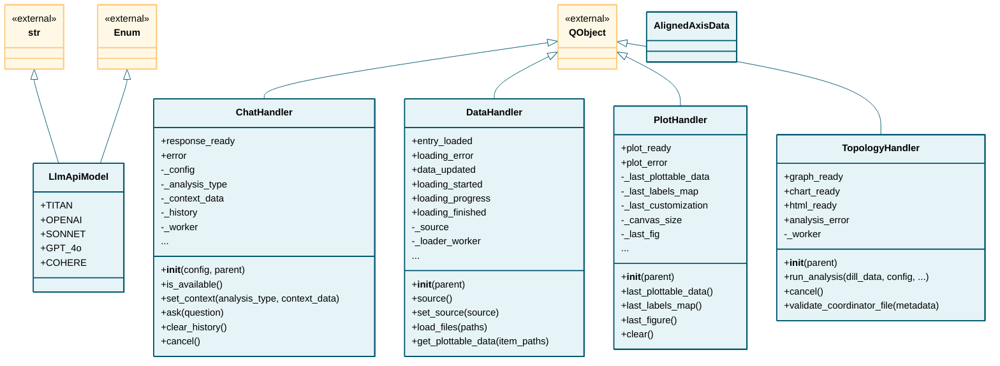

# handlers

## Class Diagram

*Click on class names to navigate to their documentation.*

## Modules

- [ChatHandler](ChatHandler.md)
- [DataHandler](DataHandler.md)
- [PlotHandler](PlotHandler.md)
- [TopologyHandler](TopologyHandler.md)
- [_axis_aligner](_axis_aligner.md)
- [_dynamic_builder](_dynamic_builder.md)
- [_plot_builder](_plot_builder.md)
- [_plot_customizer](_plot_customizer.md)
- [_static_graph_builder](_static_graph_builder.md)
- [_topology_dispatch](_topology_dispatch.md)
- [llm_api](llm_api.md)
- [llm_utils](llm_utils.md)

