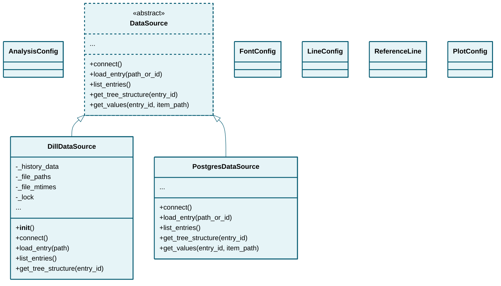

# models

## Class Diagram

*Click on class names to navigate to their documentation.*

## Modules

- [AnalysisConfig](AnalysisConfig.md)
- [DataSource](DataSource.md)
- [DillDataSource](DillDataSource.md)
- [PlotConfig](PlotConfig.md)
- [PostgresDataSource](PostgresDataSource.md)

