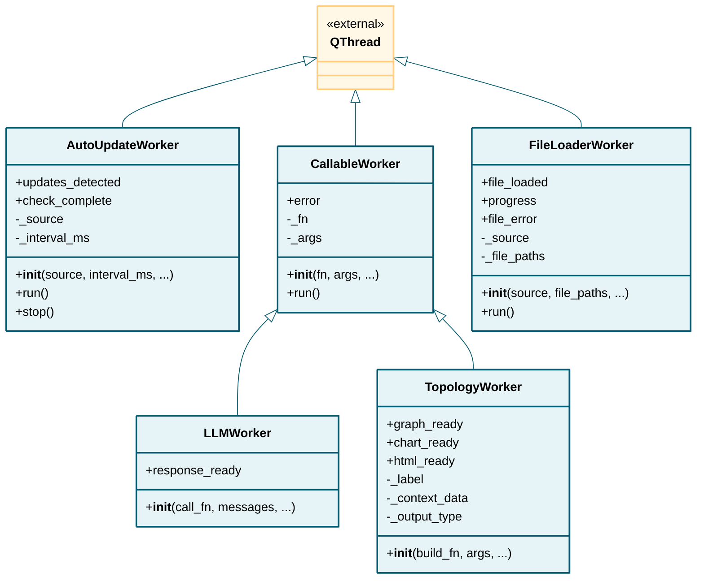

# workers

## Class Diagram

*Click on class names to navigate to their documentation.*

## Modules

- [AutoUpdateWorker](AutoUpdateWorker.md)
- [CallableWorker](CallableWorker.md)
- [FileLoaderWorker](FileLoaderWorker.md)
- [LLMWorker](LLMWorker.md)
- [TopologyWorker](TopologyWorker.md)

