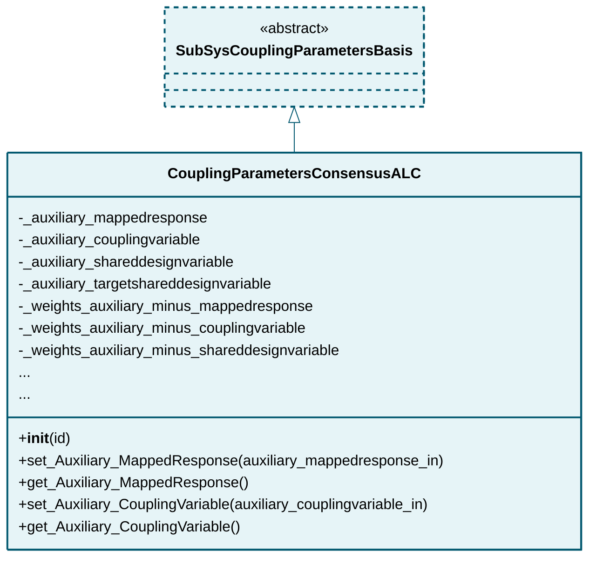

# consensus_alc

## Class Diagram

*Click on class names to navigate to their documentation.*

```mermaid
%%{init: {'theme': 'base', 'themeVariables': { 'primaryColor': '#e6f4f7', 'primaryBorderColor': '#035970', 'primaryTextColor': '#000000', 'lineColor': '#035970', 'secondaryColor': '#cce9ef', 'tertiaryColor': '#f5fafb', 'noteBkgColor': '#e6f4f7', 'noteBorderColor': '#035970', 'fontFamily': 'Arial, sans-serif'}}}%%
classDiagram
    direction TB

    %% Classes from other packages (clickable)
    class SubSysCouplingParametersBasis:::projectAbstractStyle {
        <<abstract>>
    }

    class CouplingParametersConsensusALC:::localStyle {
        -_auxiliary_mappedresponse
        -_auxiliary_couplingvariable
        -_auxiliary_shareddesignvariable
        -_auxiliary_targetshareddesignvariable
        -_weights_auxiliary_minus_mappedresponse
        -_weights_auxiliary_minus_couplingvariable
        -_weights_auxiliary_minus_shareddesignvariable
        ...
        +__init__(id)
        +set_Auxiliary_MappedResponse(auxiliary_mappedresponse_in)
        +get_Auxiliary_MappedResponse()
        +set_Auxiliary_CouplingVariable(auxiliary_couplingvariable_in)
        +get_Auxiliary_CouplingVariable()
        ...
    }

    SubSysCouplingParametersBasis <|-- CouplingParametersConsensusALC

    %% Click handlers for navigation to documentation
    click SubSysCouplingParametersBasis href "../SubSysCouplingParametersBasis/" "View SubSysCouplingParametersBasis documentation"
    click CouplingParametersConsensusALC href "CouplingParametersConsensusALC/" "View CouplingParametersConsensusALC documentation"

    %% Style definitions
    classDef packageStyle fill:#e8e8e8,stroke:#999999,stroke-width:2px
    classDef externalStyle fill:#fff8e6,stroke:#FFCC80,stroke-width:2px
    classDef projectStyle fill:#e6f4f7,stroke:#035970,stroke-width:2px
    classDef projectAbstractStyle fill:#e6f4f7,stroke:#035970,stroke-width:2px,stroke-dasharray:5 5
    classDef localStyle fill:#e6f4f7,stroke:#035970,stroke-width:2px
    classDef abstractStyle fill:#e6f4f7,stroke:#035970,stroke-width:2px,stroke-dasharray:5 5
```

## Modules

- [CouplingParametersConsensusALC](CouplingParametersConsensusALC.md)

