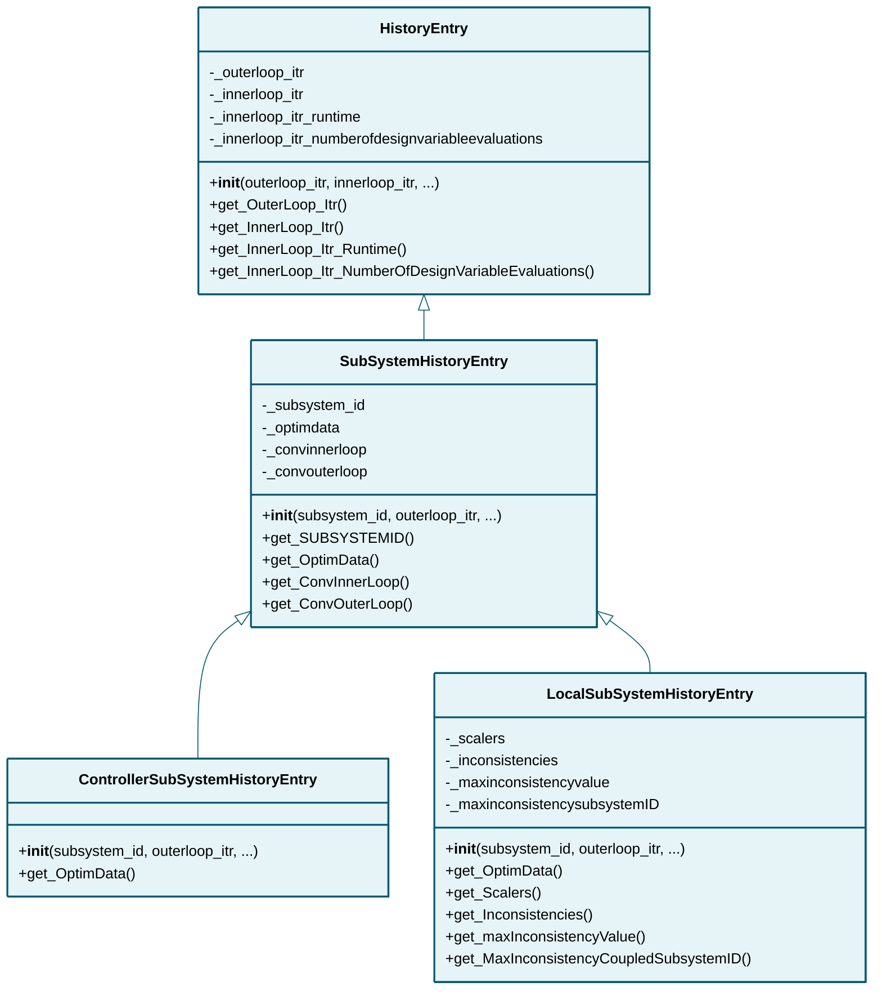

# historyentry

## Class Diagram

*Click on class names to navigate to their documentation.*

## Modules

- [ControllerSubSystemHistoryEntry](ControllerSubSystemHistoryEntry.md)
- [HistoryEntry](HistoryEntry.md)
- [LocalSubSystemHistoryEntry](LocalSubSystemHistoryEntry.md)
- [SubSystemHistoryEntry](SubSystemHistoryEntry.md)

