# subsystem

## Class Diagram

*Click on class names to navigate to their documentation.*

```mermaid
%%{init: {'theme': 'base', 'themeVariables': { 'primaryColor': '#e6f4f7', 'primaryBorderColor': '#035970', 'primaryTextColor': '#000000', 'lineColor': '#035970', 'secondaryColor': '#cce9ef', 'tertiaryColor': '#f5fafb', 'noteBkgColor': '#e6f4f7', 'noteBorderColor': '#035970', 'fontFamily': 'Arial, sans-serif'}}}%%
classDiagram
    direction TB

    %% Sub-packages (click to navigate)
    class couplingparameters["couplingparameters/"]:::packageStyle
    class historyentry["historyentry/"]:::packageStyle
    class optimization["optimization/"]:::packageStyle
    class tools["tools/"]:::packageStyle

    class ControllerSubSystemALADIN:::localStyle {
        -_couplingparameters
        -_optimization
        -_local_convergenceindicator_innerloop
        -_local_convergenceindicator_outerloop
        -_updatecouplingparametermethod_outerloop
        -_indices_map
        +__init__(neighborid, neighbors_of_neighbors_ids, ...)
        +validate_inputs()
        +set_DesignVariables(designvariables)
        +get_Indices_Map()
        +check_Decomposition(couplingparameters, id_i, ...)
        ...
    }

    class ControllerSubSystemBasis:::localStyle {
        -_optimization
        -_optimdata
        -_couplingparameters
        +__init__(neighborid)
        +initialize_Initial_Optimdata_at_Beginning()
        +mapToController()
        +run_updateCouplingParameters_outerLoop_job()
        +run_prepare_updateCouplingParameters_job()
        ...
    }

    class LocalSubSystemALADIN:::localStyle {
        -_allowedupdatemethods_outerloop
        -_recommendedupdatemethods_outerloop
        -_allowedconvergenceindicators_innerloop
        -_recommendedconvergenceindicators_innerloop
        -_allowedconvergenceindicators_outerloop
        -_recommendedconvergenceindicators_outerloop
        -_couplingparameters
        ...
        +__init__(id, level, ...)
        +validate_inputs()
        +get_Nu()
        +set_Nu(nu_in)
        +get_Sigma_i()
        ...
    }

    class LocalSubSystemALC:::localStyle {
        -_allowedupdatemethods_outerloop
        -_recommendedupdatemethods_outerloop
        -_allowedconvergenceindicators_innerloop
        -_recommendedconvergenceindicators_innerloop
        -_allowedconvergenceindicators_outerloop
        -_recommendedconvergenceindicators_outerloop
        -_couplingparameters
        ...
        +__init__(id, level, ...)
        +validate_inputs()
        +append_Controller()
        +mapToController()
        +evaluateCoordinationObjective()
        ...
    }

    class LocalSubSystemBasis:::abstractStyle {
        <<abstract>>
        -_SubsystemLevel
        -_optimization
        -_optimdata
        -_couplingparameters
        -_inconsistencies
        -_maxinconsistencyvalue
        -_maxinconsistencycoupledsubsystemID
        ...
        +__init__(id, level, ...)
        +initialize_Initial_Optimdata_at_Beginning()
        +initialize_Optimdata()
        +get_Finite_Differences_Jacobian()
        +set_Scalers(scalers)
        ...
    }

    class LocalSubSystemConsensusALC:::localStyle {
        -_allowedupdatemethods_outerloop
        -_recommendedupdatemethods_outerloop
        -_allowedconvergenceindicators_innerloop
        -_recommendedconvergenceindicators_innerloop
        -_allowedconvergenceindicators_outerloop
        -_recommendedconvergenceindicators_outerloop
        -_couplingparameters
        ...
        +__init__(id, level, ...)
        +validate_inputs()
        +append_Controller()
        +mapToController()
        +evaluate_Gradient_CoordinationObjective()
        ...
    }

    class LocalSubSystemLC:::localStyle {
        -_allowedupdatemethods_outerloop
        -_recommendedupdatemethods_outerloop
        -_allowedconvergenceindicators_innerloop
        -_recommendedconvergenceindicators_innerloop
        -_allowedconvergenceindicators_outerloop
        -_recommendedconvergenceindicators_outerloop
        -_couplingparameters
        ...
        +__init__(id, level, ...)
        +validate_inputs()
        +append_Controller()
        +mapToController()
        +evaluateCoordinationObjective()
        ...
    }

    class LocalSubSystemPC:::localStyle {
        -_allowedupdatemethods_outerloop
        -_recommendedupdatemethods_outerloop
        -_allowedconvergenceindicators_innerloop
        -_recommendedconvergenceindicators_innerloop
        -_allowedconvergenceindicators_outerloop
        -_recommendedconvergenceindicators_outerloop
        -_couplingparameters
        ...
        +__init__(id, level, ...)
        +validate_inputs()
        +append_Controller()
        +mapToController()
        +evaluateCoordinationObjective()
        ...
    }

    class LocalSubSystemSBDP:::localStyle {
        -_allowedupdatemethods_outerloop
        -_recommendedupdatemethods_outerloop
        -_allowedconvergenceindicators_innerloop
        -_recommendedconvergenceindicators_innerloop
        -_allowedconvergenceindicators_outerloop
        -_recommendedconvergenceindicators_outerloop
        -_couplingparameters
        ...
        +__init__(id, level, ...)
        +validate_inputs()
        +append_Controller()
        +mapToController()
        +evaluateCoordinationObjective()
        ...
    }

    class SubSystemBasis:::localStyle {
        -_SUBSYSTEMID
        -_neighborid
        -_name
        -_historyfolderpath
        -_optimdata
        -_couplingparameters
        -_local_convergenceindicator_innerloop
        ...
        +__init__(id, neighborid)
        +get_SUBSYSTEMID()
        +get_NeighborId()
        +set_Name(name)
        +get_Name()
        ...
    }

    class SubSystemInterface:::abstractStyle {
        <<abstract>>
        +validate_inputs()
        +get_SUBSYSTEMID()
        +get_NeighborId()
        +set_Name(name)
        +get_Name()
        ...
    }

    ControllerSubSystemBasis <|-- ControllerSubSystemALADIN
    SubSystemBasis <|-- ControllerSubSystemBasis
    LocalSubSystemBasis <|-- LocalSubSystemALADIN
    LocalSubSystemBasis <|-- LocalSubSystemALC
    SubSystemBasis <|-- LocalSubSystemBasis
    LocalSubSystemBasis <|-- LocalSubSystemConsensusALC
    LocalSubSystemBasis <|-- LocalSubSystemLC
    LocalSubSystemBasis <|-- LocalSubSystemPC
    LocalSubSystemBasis <|-- LocalSubSystemSBDP
    SubSystemInterface <|-- SubSystemBasis

    %% Click handlers for navigation to documentation
    click couplingparameters href "couplingparameters/" "Browse couplingparameters package"
    click historyentry href "historyentry/" "Browse historyentry package"
    click optimization href "optimization/" "Browse optimization package"
    click tools href "tools/" "Browse tools package"
    click ControllerSubSystemALADIN href "ControllerSubSystemALADIN/" "View ControllerSubSystemALADIN documentation"
    click ControllerSubSystemBasis href "ControllerSubSystemBasis/" "View ControllerSubSystemBasis documentation"
    click LocalSubSystemALADIN href "LocalSubSystemALADIN/" "View LocalSubSystemALADIN documentation"
    click LocalSubSystemALC href "LocalSubSystemALC/" "View LocalSubSystemALC documentation"
    click LocalSubSystemBasis href "LocalSubSystemBasis/" "View LocalSubSystemBasis documentation"
    click LocalSubSystemConsensusALC href "LocalSubSystemConsensusALC/" "View LocalSubSystemConsensusALC documentation"
    click LocalSubSystemLC href "LocalSubSystemLC/" "View LocalSubSystemLC documentation"
    click LocalSubSystemPC href "LocalSubSystemPC/" "View LocalSubSystemPC documentation"
    click LocalSubSystemSBDP href "LocalSubSystemSBDP/" "View LocalSubSystemSBDP documentation"
    click SubSystemBasis href "SubSystemBasis/" "View SubSystemBasis documentation"
    click SubSystemInterface href "SubSystemInterface/" "View SubSystemInterface documentation"

    %% Style definitions
    classDef packageStyle fill:#e8e8e8,stroke:#999999,stroke-width:2px
    classDef externalStyle fill:#fff8e6,stroke:#FFCC80,stroke-width:2px
    classDef projectStyle fill:#e6f4f7,stroke:#035970,stroke-width:2px
    classDef projectAbstractStyle fill:#e6f4f7,stroke:#035970,stroke-width:2px,stroke-dasharray:5 5
    classDef localStyle fill:#e6f4f7,stroke:#035970,stroke-width:2px
    classDef abstractStyle fill:#e6f4f7,stroke:#035970,stroke-width:2px,stroke-dasharray:5 5
```

## Subpackages

- [couplingparameters](couplingparameters/index.md)
- [historyentry](historyentry/index.md)
- [optimization](optimization/index.md)
- [tools](tools/index.md)

## Modules

- [ControllerSubSystemALADIN](ControllerSubSystemALADIN.md)
- [ControllerSubSystemBasis](ControllerSubSystemBasis.md)
- [LocalSubSystemALADIN](LocalSubSystemALADIN.md)
- [LocalSubSystemALC](LocalSubSystemALC.md)
- [LocalSubSystemBasis](LocalSubSystemBasis.md)
- [LocalSubSystemConsensusALC](LocalSubSystemConsensusALC.md)
- [LocalSubSystemLC](LocalSubSystemLC.md)
- [LocalSubSystemPC](LocalSubSystemPC.md)
- [LocalSubSystemSBDP](LocalSubSystemSBDP.md)
- [SubSystemBasis](SubSystemBasis.md)
- [SubSystemInterface](SubSystemInterface.md)

