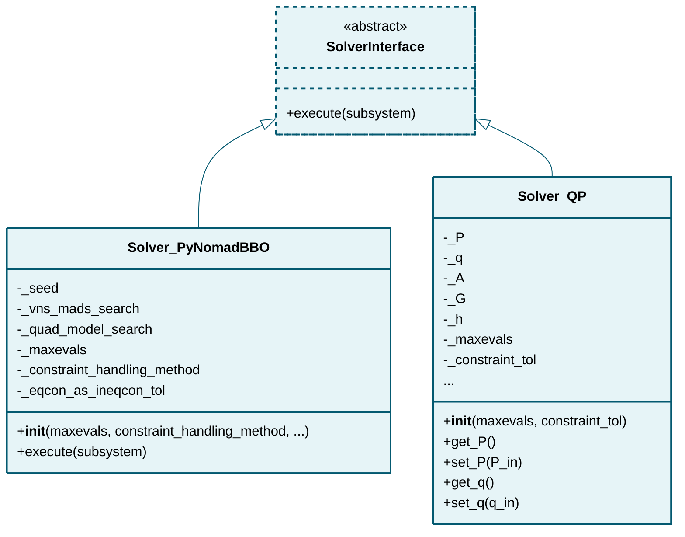

# solver

## Class Diagram

*Click on class names to navigate to their documentation.*

## Modules

- [SolverInterface](SolverInterface.md)
- [Solver_PyNomadBBO](Solver_PyNomadBBO.md)
- [Solver_QP](Solver_QP.md)

