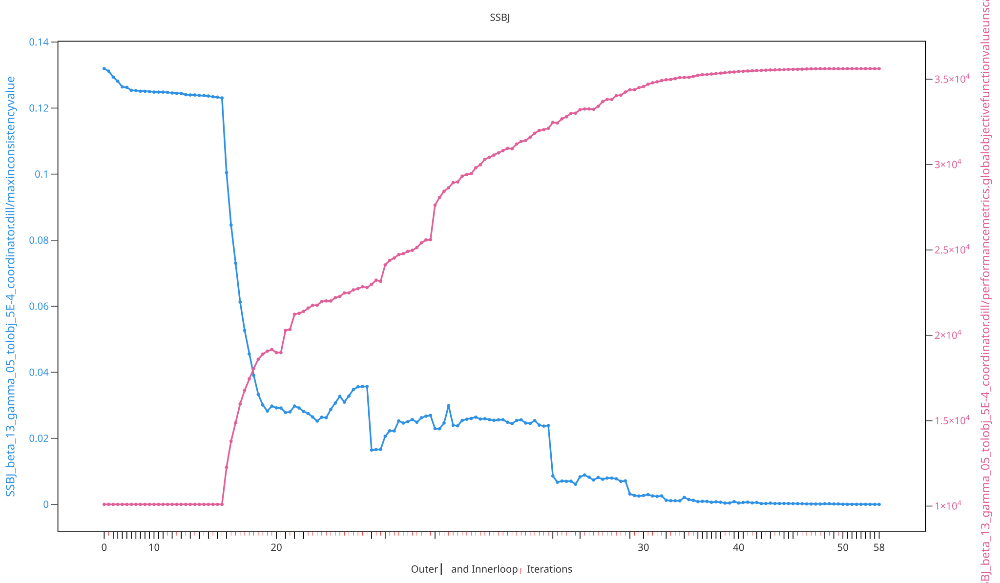

# SSBJ — Supersonic Business Jet

The abbr:SSBJ example is an engineering benchmark
problem. It couples four disciplines — aircraft (mission), propulsion,
aerodynamics, and structures — through a network of coupling and shared design
variables, making it a comprehensive, non-hierarchic test case for the
distributed coordination methods of the abbr:DDO framework. It follows the DMDO
formulation [@bayoumyDMDO2026], with equivalent implementations of the same problem in [@handawiKhbalhandawiNoHiMDO2022] and [@talgornBastientalgornNoHiMDO2025].

## 1. Problem formulation

Following the [Distributed Design Approach](../../distributed-optimization-for-multidisciplinary-design/distributed-design-approach.md),
the problem is formulated as a set of coupled subsystem optimization problems
through shared design variables ${}^{i}_{j}$sym:z and coupling variables
${}^{j}_{i}$sym:h. The distributed formulation of this example is shown below:

<iframe src="SSBJ_model.drawio.html" width="100%" height="500" style="border:none;" allowfullscreen></iframe>

## 2. Use-case implementation

The complete set of use-case specific files is available in the API Reference
under [`userfiles/SSBJ/`](../../api/userfiles/SSBJ/index.md).

## 3. Coordination method

This example is configured in
[`InputFile.py`](../../api/userfiles/SSBJ/InputFile.md) to be solved with the
[Augmented Lagrangian Coordination (ALC)](../../distributed-optimization-for-multidisciplinary-design/coordination-methods/augmented-lagrangian-coordination.md)
method. Alternative coordination methods are available as commented-out options
in the same file. The exemplary chosen coordination method and its
hyperparameters read as follows:

<div class="collapsible-code" markdown>

```python
self._coordinationmethod: CoordinationMethodInterface = ALC(convergence_indicator_innerloop=ConvergenceIndicator_Innerloop_DeWit(tolerancetotalobjective=5E-4),
                                                            convergence_indicator_outerloop=ConvergenceIndicator_Outerloop_DeWit(toleranceconsistency=1E-5),
                                                            updatecouplingparametermethod_outerloop=UpdateCouplingParameterMethod_AugLagMultipliersAdaptiveWeights(
                                                                beta=1.3,
                                                                gamma=0.5,
                                                                initialweight=0.01,
                                                                initialmultiplier=0.0),
                                                            iterationscheme=SequentialForward())
```

</div>

## 4. Processing and results

Executing the coordination method logs the optimization data into `.dill`
history files, which can be analyzed and visualized with the
[DDO Viewer](../../tutorial/processing/ddo-viewer.md) abbr:GUI. The figure below
shows exemplary information of the executed distributed design optimization for
this example:


