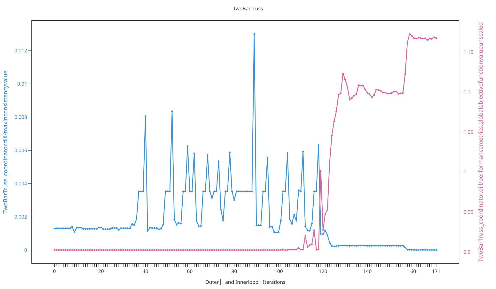

# Two-Bar Truss

The **Two-Bar Truss** example is an engineering benchmark problem taken from de
Wit's PhD thesis, Chapter 8.1 [@dewitUnifiedApproach2009a].
It decomposes a two-bar truss structure into a coordinating subsystem and
per-bar subsystems that exchange cross-sectional areas and nodal forces as
coupling variables, making it a representative engineering test case for the
abbr:DDO framework.

## 1. Problem formulation

Following the [Distributed Design Approach](../../distributed-optimization-for-multidisciplinary-design/distributed-design-approach.md),
the problem is formulated as a set of coupled subsystem optimization problems
through coupling variables ${}^{j}_{i}$sym:h. The distributed formulation
of this example is shown below:

<iframe src="TwoBarTruss_Model.drawio.html" width="100%" height="500" style="border:none;" allowfullscreen></iframe>

## 2. Use-case implementation

The complete set of use-case specific files is available in the API Reference
under [`userfiles/TwoBarTruss/`](../../api/userfiles/TwoBarTruss/index.md).

## 3. Coordination method

This example is configured in
[`InputFile.py`](../../api/userfiles/TwoBarTruss/InputFile.md) to be solved with
the
[Augmented Lagrangian Coordination (ALC)](../../distributed-optimization-for-multidisciplinary-design/coordination-methods/augmented-lagrangian-coordination.md)
method. Alternative coordination methods are available as commented-out options
in the same file. The exemplary chosen coordination method and its
hyperparameters read as follows:

<div class="collapsible-code" markdown>

```python
self._coordinationmethod: CoordinationMethodInterface = ALC(convergence_indicator_innerloop=ConvergenceIndicator_Innerloop_DeWit(tolerancetotalobjective=1E4),
                                                            convergence_indicator_outerloop=ConvergenceIndicator_Outerloop_DeWit(toleranceconsistency=1E-5),
                                                            updatecouplingparametermethod_outerloop=UpdateCouplingParameterMethod_AugLagMultipliersAdaptiveWeights(
                                                                beta=1.1,
                                                                gamma=0.95,
                                                                initialweight=0.01,
                                                                initialmultiplier=0.0),
                                                            iterationscheme=ParallelPerLevelIncreasing())
```

</div>

## 4. Processing and results

Executing the coordination method logs the optimization data into `.dill`
history files, which can be analyzed and visualized with the
[DDO Viewer](../../tutorial/processing/ddo-viewer.md) abbr:GUI. The figure below
shows exemplary information of the executed distributed design optimization for
this example:


