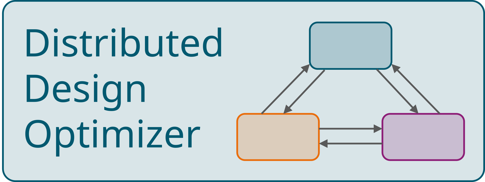

# Welcome to Distributed Design Optimizer

Multidisciplinary Design Optimization aims to enable the application of optimization algorithms to complex engineered systems, ranging from aerospace and automotive to robotics and microelectronics. Such multi-component systems typically consist of coupled subsystems, each characterized by its own design variables, constraints and objectives. Without adequate coordination of these couplings, subsystems may be optimal in isolation while the overall system remains suboptimal or even infeasible [@agteMDOAssessment2010; @bilMultidisciplinaryDesign2015a; @collopyCoordinationStrategies2019]. More details can be found in [Distributed Design Approach](distributed-optimization-for-multidisciplinary-design/distributed-design-approach.md).

Truly distributed optimization algorithms allow subsystems to retain control over their local design variables while overall optimlity and consistency is driven through coordination. Promising approaches include Primal-Dual methods [@engelmannDistributedOptimization2022] and a recent Sensitivity-based Distributed Programming method [@voneschSensitivityBasedDistributed2025]. More details can be foudn in [Categorization and Selection of Suitable Solution Approaches](distributed-optimization-for-multidisciplinary-design/categorization-and-selection-of-suitable-solution-approaches.md).

However, no general-purpose software framework currently exists that supports intuitive distributed problem definition, provides a range of suitable distributed algorithms, is modular and extensible, and enables both execution and post-processing in local or cluster-based environments.

This work introduces `DistributedDesignOptimizer`, an open-source, modular Python framework designed to fill this gap. It provides features to setup, execute and process state-of-the-art distributed optimization algorithms. Its object-oriented programming structure allows developers to implement and test their novel approaches on a set of standardized benchmark problems. Engineers can easily define their distributed optimization problem, select from a set of already implemented algorithms and execute the distributed optimization algorithm. Furthermore, the framework allows to process and analyze the algorithm's behavior in a graphical user interface, helping both developers and engineers gain insights.

The framework is assessed against the following six features:

- **Feature 1: Problem Definition** — Design engineers can formulate their distributed design optimization problem (in the spirit of [Distributed Design Approach](distributed-optimization-for-multidisciplinary-design/distributed-design-approach.md)) independent of the chosen algorithm.
- **Feature 2: Choice of Algorithm** — Design engineers can choose and execute any suitable distributed optimization algorithm mentioned in [Categorization and Selection of Suitable Solution Approaches](distributed-optimization-for-multidisciplinary-design/categorization-and-selection-of-suitable-solution-approaches.md).
- **Feature 3: Modular and Extendable Framework** — Algorithm developers can easily implement novel distributed optimization algorithms within a modular software framework mirroring the blueprint put forth by the identified [Unified Algorithmic Structure](distributed-optimization-for-multidisciplinary-design/unified-algorithmic-structure.md)
- **Feature 4: Standardized Benchmark Problems** — Design engineers and algorithm developers should be able to test and compare different algorithms on a standardized set of benchmark problems provided by the software framework.
- **Feature 5: Processing and Analysis Capabilities** — Design engineers and algorithm developers can process and analyze (preferably during runtime) the executed distributed algorithm and gain insights in order to evaluate or modify its behavior.
- **Feature 6: Local and Cluster Deployment** — The chosen distributed optimization algorithm is deployable on a local machine or a distributed computation cluster.

The following table assesses existing distributed optimization software frameworks against these features. Each circle indicates the degree of fulfilment:  fully satisfied,  partially satisfied, and  not satisfied. Frameworks that are not applicable to the distributed design optimization formulation or algorithms considered in this work are marked by an asterisk (*).

<table class="doc-table framework-comparison">
  <thead>
    <tr>
      <th>Framework</th>
      <th>Feat.&nbsp;1</th>
      <th>Feat.&nbsp;2</th>
      <th>Feat.&nbsp;3</th>
      <th>Feat.&nbsp;4</th>
      <th>Feat.&nbsp;5</th>
      <th>Feat.&nbsp;6</th>
    </tr>
  </thead>
  <tbody>
    <tr>
      <th scope="row"><a href="https://stanford.edu/~boyd/papers/admm/" target="_blank" rel="noopener">Boyd ADMM</a> [@boydDistributedOptimization2011]</th>
      <td></td>
      <td></td>
      <td></td>
      <td></td>
      <td></td>
      <td></td>
    </tr>
    <tr>
      <th scope="row">Sutor ADMM [@sutorAlternatingDirection2015]</th>
      <td></td>
      <td></td>
      <td></td>
      <td></td>
      <td></td>
      <td></td>
    </tr>
    <tr>
      <th scope="row"><a href="https://github.com/grampc/grampc-d" target="_blank" rel="noopener">GRAMPC-D</a> [@burkModularFramework2022]</th>
      <td>*</td>
      <td></td>
      <td></td>
      <td></td>
      <td></td>
      <td></td>
    </tr>
    <tr>
      <th scope="row"><a href="https://github.com/exanauts/ProxAL.jl" target="_blank" rel="noopener">ProxAL</a> [@subramanyamGloballyConvergent2021]</th>
      <td>*</td>
      <td></td>
      <td></td>
      <td></td>
      <td></td>
      <td></td>
    </tr>
    <tr>
      <th scope="row"><a href="https://git.rwth-aachen.de/acs/public/simulation/pycity_scheduling" target="_blank" rel="noopener">PycityScheduling</a> [@sobicSchedulingAggregated2025; @schwarzPycity_schedulingAPython2021]</th>
      <td>*</td>
      <td></td>
      <td></td>
      <td></td>
      <td></td>
      <td></td>
    </tr>
    <tr>
      <th scope="row"><a href="https://juliafirstorder.github.io/ProximalAlgorithms.jl/stable" target="_blank" rel="noopener">ProximalAlgorithms.jl</a> [@themelisDouglasRachford2022]</th>
      <td>*</td>
      <td></td>
      <td></td>
      <td></td>
      <td></td>
      <td></td>
    </tr>
    <tr>
      <th scope="row">pyMDO [@martinsPyMDOObjectOriented2009; @marriageAutomaticImplementation2009; @tedfordComparisonMDO2007]</th>
      <td></td>
      <td>*</td>
      <td></td>
      <td></td>
      <td></td>
      <td></td>
    </tr>
    <tr>
      <th scope="row"><a href="https://openmdao.org/" target="_blank" rel="noopener">OpenMDAO</a> [@grayOpenMDAOOpensource2019], <a href="https://gemseo.readthedocs.io/en/stable/" target="_blank" rel="noopener">GEMSEO</a> [@gallardGEMSPython2018]</th>
      <td></td>
      <td>*</td>
      <td></td>
      <td></td>
      <td></td>
      <td></td>
    </tr>
    <tr>
      <th scope="row"><a href="https://github.com/alexe15/ALADIN.m" target="_blank" rel="noopener">ALADIN-&alpha;</a> [@engelmannALADINAnOpensource2022]</th>
      <td></td>
      <td></td>
      <td></td>
      <td></td>
      <td></td>
      <td></td>
    </tr>
    <tr>
      <th scope="row"><a href="https://github.com/OPT4SMART/disropt" target="_blank" rel="noopener">DISROPT</a> [@farinaDISROPTPython2020]</th>
      <td></td>
      <td></td>
      <td></td>
      <td></td>
      <td></td>
      <td></td>
    </tr>
    <tr>
      <th scope="row">atcPortal / atcEngine [@huangExtensibleMultiagent2006a]</th>
      <td></td>
      <td></td>
      <td></td>
      <td></td>
      <td></td>
      <td></td>
    </tr>
    <tr>
      <th scope="row">ALC Matlab toolbox [@tosseramsUsingALC2009a]</th>
      <td></td>
      <td></td>
      <td></td>
      <td></td>
      <td></td>
      <td></td>
    </tr>
    <tr>
      <th scope="row"><a href="https://github.com/bastientalgorn/NoHiMDO" target="_blank" rel="noopener">NoHiMDO</a>, <a href="https://github.com/Ahmed-Bayoumy/DMDO" target="_blank" rel="noopener">DMDO</a>, <a href="https://github.com/johnmartins/nhatc" target="_blank" rel="noopener">NHATC</a></th>
      <td></td>
      <td></td>
      <td></td>
      <td></td>
      <td></td>
      <td></td>
    </tr>
    <tr>
      <th scope="row">mlprogram [@dewitUnifiedApproach2009a]</th>
      <td></td>
      <td></td>
      <td></td>
      <td></td>
      <td></td>
      <td></td>
    </tr>
    <tr class="group-start highlight-row">
      <th scope="row"><strong>DistributedDesignOptimizer</strong></th>
      <td></td>
      <td></td>
      <td></td>
      <td></td>
      <td></td>
      <td></td>
    </tr>
  </tbody>
</table>

**Acknowledgement**

*The abbr:DDO contributors gratefully acknowledge Albert de Wit for generously sharing the source files of the `mlprogram` framework [@dewitUnifiedApproach2009a], from
which `DistributedDesignOptimizer` is derived. His openness and willingness to share his work laid the foundation for this framework and is deeply appreciated
by the abbr:DDO contributors.*

The abbr:DDO is under continued active development. See [Roadmap and Contribution > Reporting Issues](roadmap-and-contribution/reporting-issues.md), [Roadmap and Contribution > Roadmap](roadmap-and-contribution/roadmap.md) for details.
