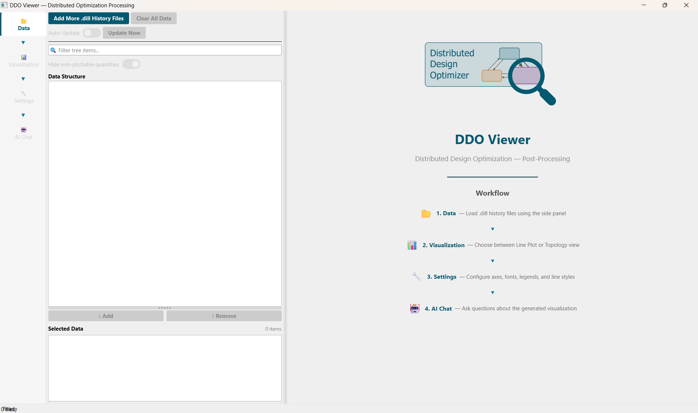
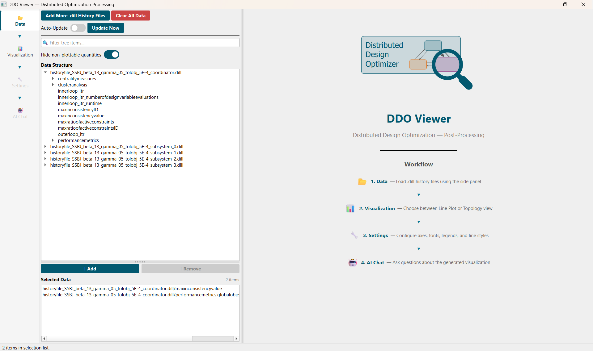
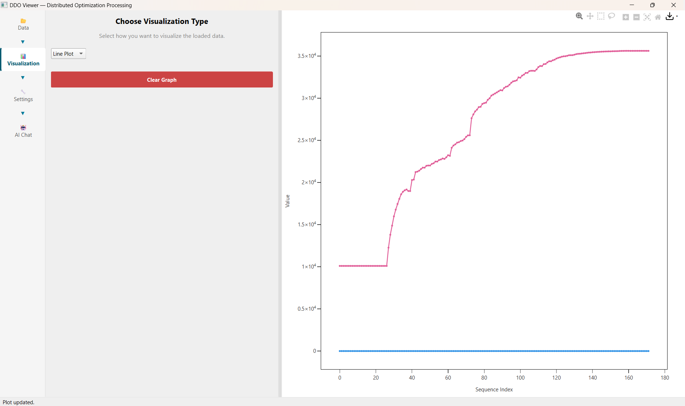
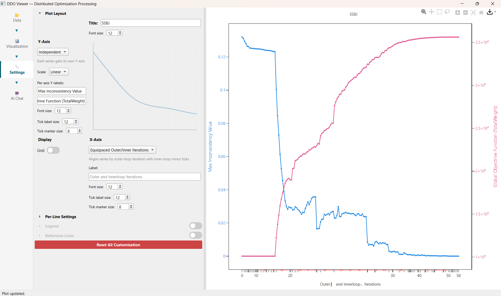

# DDO Viewer

## Executing the DDO Viewer

The abbr:GUI of the abbr:DDO Viewer for (post-) processing of entire optimization executions starts by calling the `main()` of `main_ddo_viewer.py` in a new terminal (separate from the terminal executing the coordination method itself as detailed in [Tutorial > Problem Definition and Algorithm Execution](../problem-definition-and-algorithm-execution/index.md#8-executing-the-coordination-method)).

This section covers how to perform (post-) processing and analysis using the abbr:GUI in order to gain deeper insights into both algorithm behavior and the solved distributed design optimization problem. A step-by-step guide is illustrated for the [SSBJ](../../examples/SSBJ/index.md) Example (solved with two different hyperparameter configurations for comparative analysis) below.

## 1. Data Panel

The abbr:DDO Viewer offers various functionalities to analyse and visualize the data logged and stored into `.dill` files during an optimization execution (see [Data Logging](../../framework-architecture/data-logging.md)). It is also possible to process multiple `.dill` files from multiple optimization executions.

First, the `.dill` files of interest are selected and loaded into the Data Panel by clicking on the `Add More .dill History Files` button. The `Auto-Update` switch and `Update Now` button allow to refresh any analysis once updated `.dill` files are stored by the abbr:DDO framework during an ongoing optimization execution. This allows to process the coordination during runtime. 
As detailed in [Data Logging](../../framework-architecture/data-logging.md), [`Coordinator`](../../api/Distributed_Design_Optimizer/coordination/Coordinator.md), [`LocalSubSystemBasis`](../../api/Distributed_Design_Optimizer/subsystem/LocalSubSystemBasis.md) and [`ControllerSubSystemBasis`](../../api/Distributed_Design_Optimizer/subsystem/ControllerSubSystemBasis.md) store their relevant information into `.dill` files. Each `.dill` file contains a queue of typed *history entry* snapshots &mdash; one per inner loop iteration &mdash; namely [`CoordinatorHistoryEntry`](../../api/Distributed_Design_Optimizer/coordination/CoordinatorHistoryEntry.md) for the coordinator, and [`LocalSubSystemHistoryEntry`](../../api/Distributed_Design_Optimizer/subsystem/historyentry/LocalSubSystemHistoryEntry.md) / [`ControllerSubSystemHistoryEntry`](../../api/Distributed_Design_Optimizer/subsystem/historyentry/ControllerSubSystemHistoryEntry.md) for the subsystems.

The `Data Structure` window lists the plottable quantities stored in the selected `.dill` files. These quantities are discovered automatically from the fields of the [history entry](../../framework-architecture/data-logging.md) objects. The quantities of interest are selected by using the `Add` button.

As an example, the *coupling constraint* violation ${}^{1}_{0}$sym:c ([All-At-Once Problem Formulation and Decomposition](../../distributed-optimization-for-multidisciplinary-design/categorization-and-selection-of-suitable-solution-approaches.md#all-at-once-problem-formulation-and-decomposition)) between subsystem 0 and 1 is selected in the following illustration.

## 2. Visualization Panel

Having selected `.dill` files in the Data Panel, the Visualization Panel offers different analysis graphs. Currently, only the `Line Plot` visualization is available. Upon selection, the corresponding plot is shown on the right of the abbr:GUI.

## 3. Settings Panel

Depending on the chosen Visualization type (`Line Plot` in this case), the Settings Panel offers various further options and customizations to gain further insights. This includes various options for the Y- and X-Axis configuration as illustrated below.

## 4. AI Chat Panel

TODO
